  

  

---

<h2 align="center">🎨 Tech Stack</h2>

  

 

<h2 align="center">📊 Analytics Dashboard</h2>

  
  
   
  
  
  
  
   
  
  

---

<h2 align="center">🚀 Deep Analysis</h2>

  

---

<h2 align="center">📈 Activity Graph</h2>

  

---

<h2 align="center">🏆 Achievements</h2>

  

---

<h2 align="center">🐍 Contribution Snake</h2>

  

---

  

